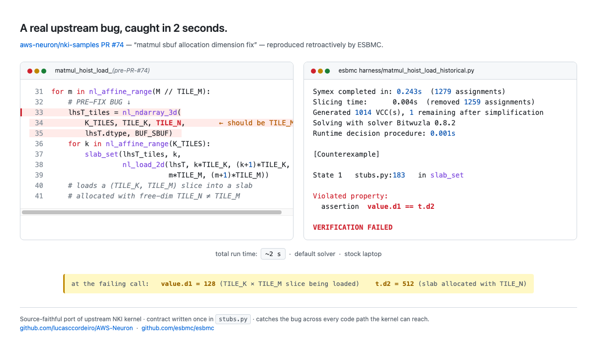

# ESBMC + AWS NKI — proof-of-concept

A small, runnable demonstration that the [AWS Neuron Kernel Interface
(NKI)](https://awsdocs-neuron.readthedocs-hosted.com/en/latest/) kernels
can be partially verified by [ESBMC](https://github.com/esbmc/esbmc), using
a thin Python stub library that models NKI tile shapes and bounds — without
executing on a real NeuronCore.

The verifier runs in two phases:

- **Phase 1 (default flags)** — shape and bounds contracts on every NKI
  kernel call (partition-dim limits, in-bounds slicing, shape-equality on
  DMA / elementwise / matmul, hardware constraints on the matmul unit),
  via stub asserts. Contract violations surface as precise counterexamples.
- **Phase 2 (`--overflow-check`, default div-by-zero)** — safety
  properties on host-side index arithmetic. Signed-integer overflow and
  integer division-by-zero, mapped to CWE-190 / CWE-369. Rediscovers the
  upstream AUDIT-15 `ZeroDivisionError` on `chunk_size = 1` *without*
  relying on the port-time precondition that currently guards it.

## What this looks like in practice

The PoC reproduces a real shipped bug from
[aws-neuron/nki-samples PR #74](https://github.com/aws-neuron/nki-samples/pull/74)
("matmul sbuf allocation dimension fix"). The pre-PR `nki_matmul_hoist_load_`
allocated `lhsT_tiles` with free-dim `TILE_N` (=512) when it should have been
`TILE_M` (=128). ESBMC catches the resulting shape mismatch retroactively, in
about two seconds on a laptop:



(The figure regenerates from
[`figures/bug_pr74.html`](figures/bug_pr74.html) — open it in a browser
for the same rendering at any zoom level.)

## Layout

```
.
├── verify.py           # manifest of (entry script, ESBMC args, expected verdict)
├── Makefile            # `make verify`
├── REPORT.md           # full method, soundness analysis, scope, coverage
├── RETROSPECTIVE.md    # narrative summary aimed at the ESBMC team
├── AUDIT.md            # stub-correctness audit + incident log
└── harness/            # everything ESBMC sees
    ├── stubs.py        # canonical stub library — single source of truth
    ├── kernels/        # ported NKI kernels, each `from stubs import *`
    │   └── <name>.py
    └── <name>.py       # entry scripts; import stubs + kernels.<name>
```

ESBMC's Python frontend searches the entry script's directory for modules,
so `stubs.py` and `kernels/` live next to the entry scripts under
`harness/`. Each entry script imports the stub names and the kernel
function it exercises, sets up concrete (or nondet) input shapes, and
asserts the kernel's output contract.

## Targets

| Target | Entry script (harness/) | Kernel module | Expected |
|---|---|---|---|
| `tensor_add` | `tensor_add.py` | `kernels/tensor_add.py` | `SUCCESSFUL` |
| `tensor_add_buggy` | `tensor_add_buggy.py` | `kernels/tensor_add_buggy.py` | `FAILED` |
| `tensor_add_symbolic` | `tensor_add_symbolic.py` | `kernels/tensor_add.py` | `SUCCESSFUL` (`--unwind 6`) |
| `transpose2d` | `transpose2d.py` | `kernels/transpose2d.py` | `SUCCESSFUL` |
| `transpose2d_buggy` | `transpose2d_buggy.py` | `kernels/transpose2d_buggy.py` | `FAILED` |
| `matmul` | `matmul.py` | `kernels/matmul.py` | `SUCCESSFUL` |
| `matmul_big` | `matmul_big.py` | `kernels/matmul.py` | `SUCCESSFUL` |
| `matmul_buggy` | `matmul_buggy.py` | `kernels/matmul_buggy.py` | `FAILED` |
| `maxpooling` | `maxpooling.py` | `kernels/maxpooling.py` | `SUCCESSFUL` |
| `maxpooling_buggy` | `maxpooling_buggy.py` | `kernels/maxpooling_buggy.py` | `FAILED` |
| `interpolate_bilinear` | `interpolate_bilinear.py` | `kernels/interpolate_bilinear.py` | `SUCCESSFUL` |
| `interpolate_bilinear_buggy` | `interpolate_bilinear_buggy.py` | `kernels/interpolate_bilinear_buggy.py` | `FAILED` |
| `interpolate_trilinear` | `interpolate_trilinear.py` | `kernels/interpolate_trilinear.py` | `SUCCESSFUL` |
| `interpolate_trilinear_buggy` | `interpolate_trilinear_buggy.py` | `kernels/interpolate_trilinear_buggy.py` | `FAILED` |
| `interpolate_bilinear_chunk1` | `interpolate_bilinear_chunk1.py` | `kernels/interpolate_bilinear.py` | `FAILED` — chunk_size=1 boundary input (AUDIT Finding 15) |
| `interpolate_trilinear_chunk1` | `interpolate_trilinear_chunk1.py` | `kernels/interpolate_trilinear.py` | `FAILED` — same boundary as bilinear |
| `audit15_hostarith_unguarded` | `audit15_hostarith_unguarded.py` | — (standalone) | phase-2 only: `FAILED` with `division by zero` (CWE-369) on the upstream trip-count expression at `chunk_size = 1` |
| `matmul_basic` | `matmul_basic.py` | `kernels/matmul_basic.py` | `SUCCESSFUL` |
| `matmul_basic_buggy` | `matmul_basic_buggy.py` | `kernels/matmul_basic_buggy.py` | `FAILED` |
| `mamba_v1` | `mamba_v1.py` | `kernels/mamba_v1.py` | `SUCCESSFUL` |
| `mamba_v1_buggy` | `mamba_v1_buggy.py` | `kernels/mamba_v1_buggy.py` | `FAILED` |
| `transpose2d_symbolic` | `transpose2d_symbolic.py` | `kernels/transpose2d.py` | `SUCCESSFUL` (`--unwind 5`; F1, F2 ∈ [1, 4]) |
| `maxpooling_symbolic` | `maxpooling_symbolic.py` | `kernels/maxpooling.py` | `SUCCESSFUL` (`--unwind 5`; H = k·128, k ∈ [1, 4]) |
| `mamba_v1_symbolic` | `mamba_v1_symbolic.py` | `kernels/mamba_v1.py` | `SUCCESSFUL` (`--unwind 5`; state ∈ [1, 4], seq ∈ [2, 8]) |
| `interpolate_bilinear_symbolic` | `interpolate_bilinear_symbolic.py` | `kernels/interpolate_bilinear.py` | `SUCCESSFUL` (`--unwind 5`; H_src, W_src ∈ {10, 19, 28}) |
| `interpolate_trilinear_symbolic` | `interpolate_trilinear_symbolic.py` | `kernels/interpolate_trilinear.py` | `SUCCESSFUL` (`--unwind 5`; D_src, H_src, W_src ∈ {10, 19}) |
| `matmul_tiled` | `matmul_tiled.py` | `kernels/matmul_tiled.py` | `SUCCESSFUL` |
| `matmul_tiled_buggy` | `matmul_tiled_buggy.py` | `kernels/matmul_tiled_buggy.py` | `FAILED` |
| `matmul_tiled_symbolic` | `matmul_tiled_symbolic.py` | `kernels/matmul_tiled.py` | `SUCCESSFUL` (`--unwind 4`; M ∈ {128, 256, 384}, N ∈ {512, 1024}) |
| `matmul_hoist_load` | `matmul_hoist_load.py` | `kernels/matmul_hoist_load.py` | `SUCCESSFUL` |
| `matmul_hoist_load_buggy` | `matmul_hoist_load_buggy.py` | `kernels/matmul_hoist_load_buggy.py` | `FAILED` |
| `matmul_hoist_load_historical` | `matmul_hoist_load_historical.py` | `kernels/matmul_hoist_load_historical.py` | `FAILED` — reproduces the pre-fix bug from upstream [aws-neuron/nki-samples#74](https://github.com/aws-neuron/nki-samples/pull/74) |
| `matmul_block_free` | `matmul_block_free.py` | `kernels/matmul_block_free.py` | `SUCCESSFUL` |
| `matmul_block_free_buggy` | `matmul_block_free_buggy.py` | `kernels/matmul_block_free_buggy.py` | `FAILED` |
| `matmul_fully_optimized` | `matmul_fully_optimized.py` | `kernels/matmul_fully_optimized.py` | `SUCCESSFUL` |
| `matmul_fully_optimized_buggy` | `matmul_fully_optimized_buggy.py` | `kernels/matmul_fully_optimized_buggy.py` | `FAILED` |
| `mamba_v2` | `mamba_v2.py` | `kernels/mamba_v2.py` | `SUCCESSFUL` |
| `mamba_v2_buggy` | `mamba_v2_buggy.py` | `kernels/mamba_v2_buggy.py` | `FAILED` |
| `mamba_v3` | `mamba_v3.py` | `kernels/mamba_v3.py` | `SUCCESSFUL` |
| `mamba_v3_buggy` | `mamba_v3_buggy.py` | `kernels/mamba_v3_buggy.py` | `FAILED` |
| `mamba_v3_symbolic` | `mamba_v3_symbolic.py` | `kernels/mamba_v3.py` | `SUCCESSFUL` (`--unwind 5`; STATE ∈ [1, 4], num_seq_tiles ∈ [1, 3]) |
| `avgpool` | `avgpool.py` | `kernels/avgpool.py` | `SUCCESSFUL` |
| `avgpool_buggy` | `avgpool_buggy.py` | `kernels/avgpool_buggy.py` | `FAILED` |
| `avgpool_symbolic` | `avgpool_symbolic.py` | `kernels/avgpool.py` | `SUCCESSFUL` (`--unwind 5`; H, W ∈ {6, 8, 10}) |
| `attn_fwd_v1` | `attn_fwd_v1.py` | `kernels/attn_fwd_v1.py` | `SUCCESSFUL` |
| `attn_fwd_v1_buggy` | `attn_fwd_v1_buggy.py` | `kernels/attn_fwd_v1_buggy.py` | `FAILED` |
| `attn_fwd_v2` | `attn_fwd_v2.py` | `kernels/attn_fwd_v2.py` | `SUCCESSFUL` |
| `attn_fwd_v2_buggy` | `attn_fwd_v2_buggy.py` | `kernels/attn_fwd_v2_buggy.py` | `FAILED` |
| `attn_fwd_v3` | `attn_fwd_v3.py` | `kernels/attn_fwd_v3.py` | `SUCCESSFUL` (`--unwind 5`; seqlen = 512) |
| `attn_fwd_v3_buggy` | `attn_fwd_v3_buggy.py` | `kernels/attn_fwd_v3_buggy.py` | `FAILED` (`--unwind 5`) |
| `attn_fwd_v3_symbolic` | `attn_fwd_v3_symbolic.py` | `kernels/attn_fwd_v3.py` | `SUCCESSFUL` (`--unwind 9`; SEQLEN ∈ {512, 1024}) |
| `pipelined_attention` | `pipelined_attention.py` | `kernels/pipelined_attention.py` | `SUCCESSFUL` (shape-skeleton only; inner Flash Attention pipeline deferred — see ROADMAP) |

`verify.py` is the single source of truth for these pairings, the ESBMC
flags, and the expected verdicts.

## How to run

Requires ESBMC 8.3.0 or later with the Python frontend. The list of
upstream issues this PoC depends on (and the PRs that closed each one)
is in `RETROSPECTIVE.md`.

```bash
make verify                       # run both phases on every target, tally results
python3 verify.py NAME            # run a single target (both phases if it opts into both)
python3 verify.py --phase=1       # phase-1 only (shape and bounds)
python3 verify.py --phase=2       # phase-2 only (safety properties)
make dashboard                    # rebuild dashboard.html from current data
```

[`dashboard.html`](dashboard.html) is a single self-contained HTML page
that pulls live data from `verify.py` and `RETROSPECTIVE.md` — headline
stats, all targets with kind/family/flags, every ESBMC issue filed with
its status, kernel coverage tree, and source-rewriting status. Open it
locally after `make dashboard` to see the current state of the PoC.

Concrete-shape targets complete in 1–3 seconds wall-clock each on a
stock laptop. The ten symbolic-shape targets run for ~5–90 seconds
depending on the size of the shape family they sweep. Phase-1 (51 runs)
finishes in about 9 minutes; phase-2 (21 runs, concrete-shape good
kernels + the AUDIT-15 reproducer) finishes in about 3 minutes; the
combined two-phase sweep is ~12 minutes end-to-end.

## Where to read more

- **`REPORT.md`** — full method, contract provenance, soundness analysis,
  stub-library catalogue, kernel coverage, what doesn't yet work.
- **`RETROSPECTIVE.md`** — narrative summary aimed at the ESBMC team:
  what the PoC exercised, the upstream issues filed and how each
  retired, source-rewriting history, verification patterns.
- **`AUDIT.md`** — stub-correctness audit (the original duplicated-stubs
  diff plus the per-port contract-tightness incidents).
- **`ROADMAP.md`** — what's left to port, grouped by stub-library effort.

## Provenance

- ESBMC: https://github.com/esbmc/esbmc — 8.3.0, default Bitwuzla solver.
- NKI samples: https://github.com/aws-neuron/nki-samples — the
  `tensor_addition`, `transpose2d`, `matrix_multiplication`,
  `fused_mamba`, `average_pool2d`, `attention_fwd_performance` (v1)
  tutorials and the `contributed/{matmul, maxpooling,
  interpolate_bilinear_fwd, interpolate_trilinear_fwd}` community
  kernels. Pinned snapshot `a87aaa44`.
